

<i class="bi bi-search"></i><input type="text" id="paper-search" placeholder="Search by title, topic, or keyword…" aria-label="Search papers">

<button class="filter-chip active" data-tag="all">All</button>
<button class="filter-chip" data-tag="published">Published</button>
<button class="filter-chip" data-tag="reports">Reports</button>
<button class="filter-chip" data-tag="working-papers">Working papers</button>

## Published {.research-head}

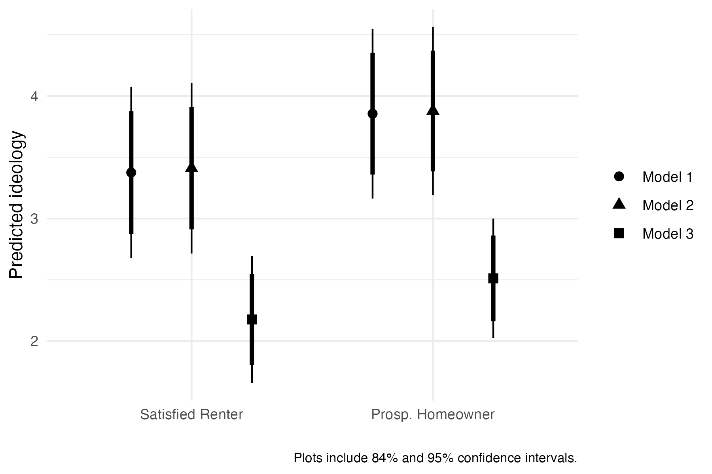

<h3>The Political Preferences of Prospective Homeowners: Evidence from Canada</h3>

Canadian Journal of Political Science &middot; 2026 &middot; with Michelle L. Dion

Political scientists often assume homeownership makes people more conservative. But what about renters who <em>want</em> to buy? We argue that renting is not a monolith. Distinguishing between "satisfied renters" and "prospective homeowners," we use a first-of-its-kind survey of Canadian renters to show that prospective owners already hold more right-wing views on redistribution <em>before</em> the house is bought, suggesting the "homeowner effect" may partly be a selection effect. Notably, this ideological shift does not translate into greater support for right-wing parties at the ballot box.

<a class="btn-paper" href="files/2026-homeowners.pdf"><i class="bi bi-file-pdf"></i> PDF</a> <a class="btn-paper" href="https://doi.org/10.1017/S0008423926101036"><i class="bi bi-journal-text"></i> Journal</a>

<button class="tag" data-tag="political-economy">Political economy</button> <button class="tag" data-tag="public-opinion">Public opinion</button>

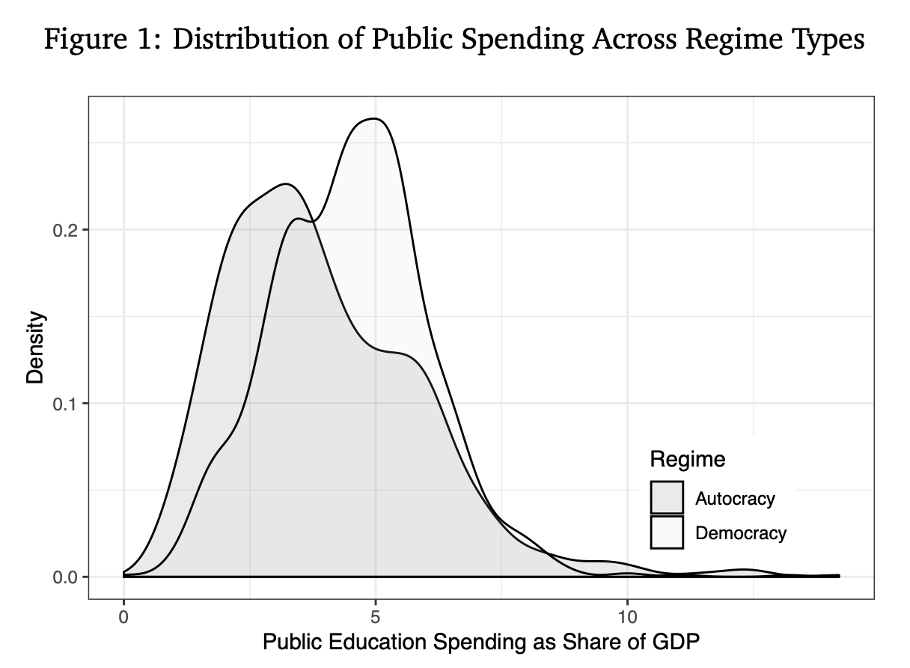

<h3>Democracy, Rural Inequality, and Education Spending</h3>

World Development &middot; 2022 &middot; with David Samuels

Democracies are supposed to invest in their people, yet many democratic nations spend surprisingly little on education. We argue the culprit is often the landed elite. While urban industries want educated workers, agricultural elites fear that education will encourage laborers to migrate to cities, driving up rural wages. Using data from 107 countries, we show that democracy only boosts human capital investment where land inequality is low. Where landed elites remain powerful, they successfully lobby to defund public education, effectively blocking the path to development for the rural poor.

<a class="btn-paper" href="files/2022-democracy-inequality.pdf"><i class="bi bi-file-pdf"></i> PDF</a> <a class="btn-paper" href="https://doi.org/10.1016/j.worlddev.2022.106136"><i class="bi bi-journal-text"></i> Journal</a>

<button class="tag" data-tag="education">Education</button> <button class="tag" data-tag="political-economy">Political economy</button>

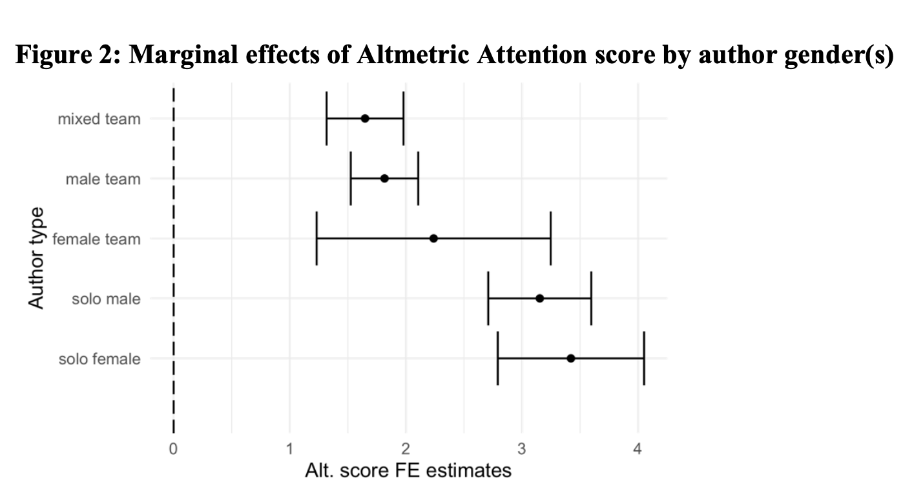

<h3>Closing the Gender Gap? How Altmetrics Influence Citations</h3>

International Studies Perspectives &middot; 2022 &middot; with Michelle L. Dion &amp; Sara McLaughlin Mitchell

Political science, like many disciplines, has a gendered citation gap: men tend to cite other men. This paper explores whether tweets and blog posts can help improve the exposure of women. Analyzing over 8,000 articles, we find that online promotion significantly boosts formal academic citations, with women benefiting the most. While social media might not be a silver bullet, active online engagement seems like a powerful tool for women scholars to reclaim visibility and narrow the citation gap.

<a class="btn-paper" href="files/2022-altmetrics-gender.pdf"><i class="bi bi-file-pdf"></i> PDF</a> <a class="btn-paper" href="https://academic.oup.com/isp/article-abstract/24/2/189/6705570"><i class="bi bi-journal-text"></i> Journal</a>

<button class="tag" data-tag="gender-open-science">Gender &amp; open science</button>

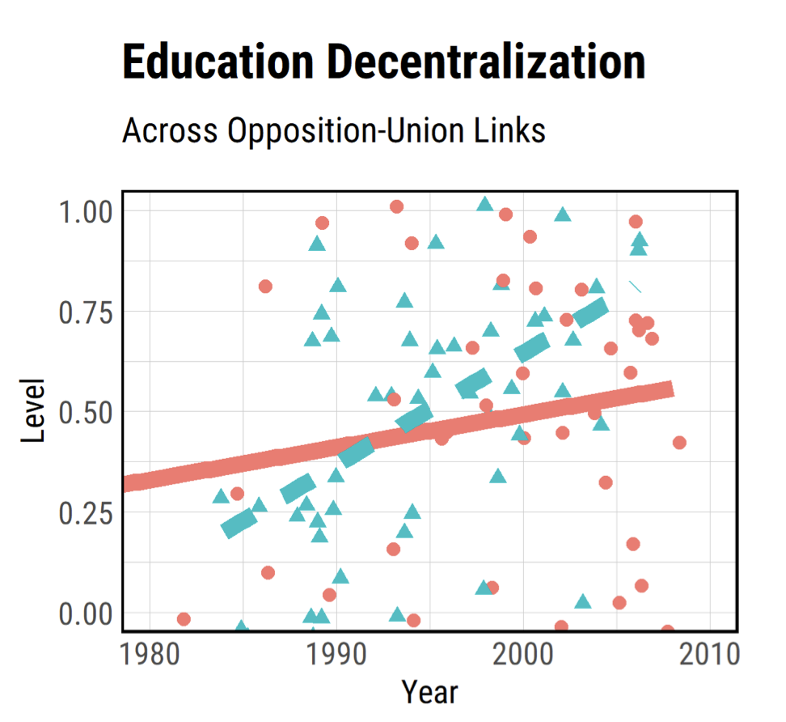

<h3>Decentralization as a Political Weapon</h3>

Comparative Politics &middot; 2021

Why do some governments push to decentralize education while others centralize control? Conventional wisdom says it's about improving school quality. Drawing on evidence from El Salvador and Paraguay, I argue the motivation is often far more cynical: decentralization is a political weapon. By shifting hiring power to local levels, ruling parties can fragment powerful national teachers' unions affiliated with the opposition. This strategy effectively demobilizes rival voting blocs, turning education policy into a tool for regime survival rather than student success.

<a class="btn-paper" href="files/2021-decentralization.pdf"><i class="bi bi-file-pdf"></i> PDF</a> <a class="btn-paper" href="https://www.ingentaconnect.com/content/cuny/cp/2022/00000055/00000001/art00003"><i class="bi bi-journal-text"></i> Journal</a>

<button class="tag" data-tag="education">Education</button> <button class="tag" data-tag="political-economy">Political economy</button>

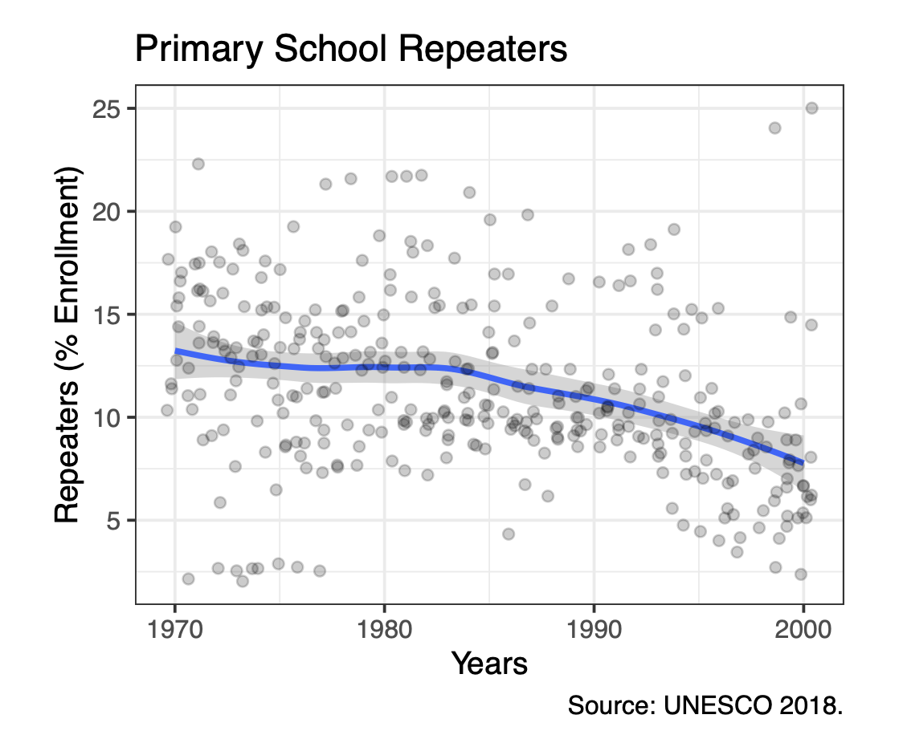

<h3>Flying Blind: Education Reform in Latin America</h3>

International Journal of Education Reform &middot; 2020

It is often assumed that the wave of education reforms in 1990s Latin America was a necessary response to a "crisis" of failing schools. However, a review of the historical data shows that enrollment and completion rates were actually high, and there was little empirical evidence at the time suggesting a quality crisis. If the schools weren't broken, why fix them? This paper challenges the standard narrative, arguing that we need to look past technical explanations and revisit the political incentives that drove leaders to overhaul systems that were, by most metrics, working reasonably well.

<a class="btn-paper" href="files/2020-flying-blind.pdf"><i class="bi bi-file-pdf"></i> PDF</a> <a class="btn-paper" href="https://journals.sagepub.com/doi/10.1177/1056787920931487"><i class="bi bi-journal-text"></i> Journal</a>

<button class="tag" data-tag="education">Education</button>

## Reports {.research-head}

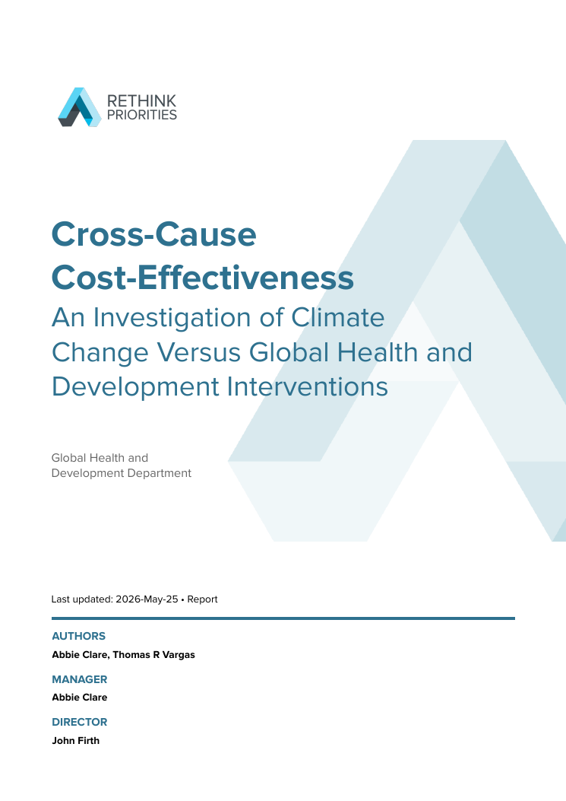

<h3>Cross-Cause Cost-Effectiveness: Climate Change versus Global Health and Development</h3>

Rethink Priorities &middot; 2026 &middot; with Abbie Clare

Can a dollar do more good fighting climate change or funding global health and development? This report builds a transparent framework to compare the two head-to-head. Drawing on interviews with EA-aligned experts, we isolate five "cruxes" that drive the comparison &mdash; from the marginal cost of abating a tonne of CO&#8322;e to philosophical choices like sure-bet versus hits-based giving &mdash; and build two models estimating cost per life saved. We find climate interventions can be competitive with top GHD opportunities, but only under specific conditions: hits-based climate bets, low abatement costs, and valuing the health damages of air pollution alongside warming.

<a class="btn-paper" href="files/2026-climate-vs-ghd.pdf"><i class="bi bi-file-pdf"></i> PDF</a>

<button class="tag" data-tag="global-health">Global health</button> <button class="tag" data-tag="cost-effectiveness">Cost-effectiveness</button>

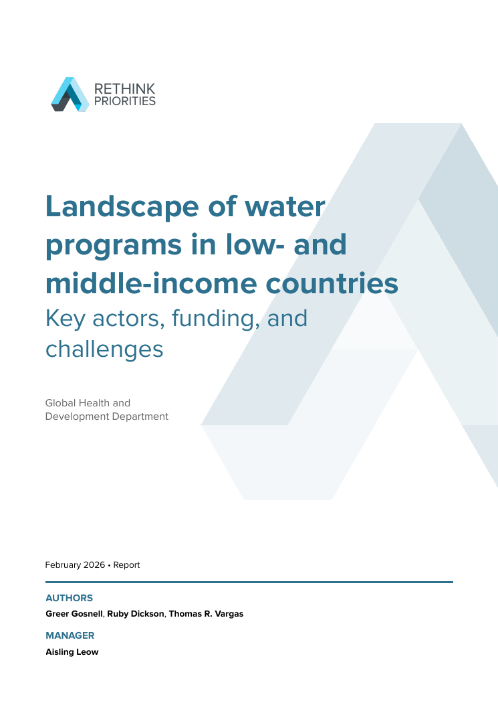

<h3>Landscape of Water Programs in Low- and Middle-Income Countries</h3>

Rethink Priorities &middot; 2026 &middot; with Greer Gosnell &amp; Ruby Dickson

Where does money go in the global water sector, and who are the key players? This landscaping report maps the organizations working on water, sanitation, and hygiene (WASH) in low- and middle-income countries. From a longlist of 285 implementers we vetted 98 and profiled 29 in depth &mdash; spanning large NGOs, bilateral-aid contractors, and small specialist outfits &mdash; alongside the major funders and the debates shaping the sector. The result is a practical guide for donors trying to navigate a crowded, underfunded, but high-impact space.

<a class="btn-paper" href="files/2026-water-landscape.pdf"><i class="bi bi-file-pdf"></i> PDF</a>

<button class="tag" data-tag="global-health">Global health</button>

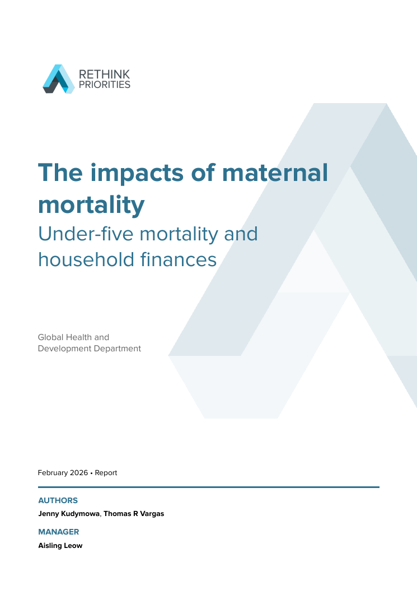

<h3>The Impacts of Maternal Mortality: Under-Five Mortality and Household Finances</h3>

Rethink Priorities &middot; 2026 &middot; with Jenny Kudymowa

When a mother dies, what happens to the family she leaves behind? Commissioned by GiveWell, this report synthesizes the evidence on the downstream effects of maternal mortality in low-income countries, focusing on under-five mortality and household finances. We estimate how many additional child deaths tend to follow each maternal death, trace the consequences for family health and income, and assess how strong the underlying evidence really is.

<a class="btn-paper" href="files/2026-maternal-mortality-impacts.pdf"><i class="bi bi-file-pdf"></i> PDF</a>

<button class="tag" data-tag="global-health">Global health</button>

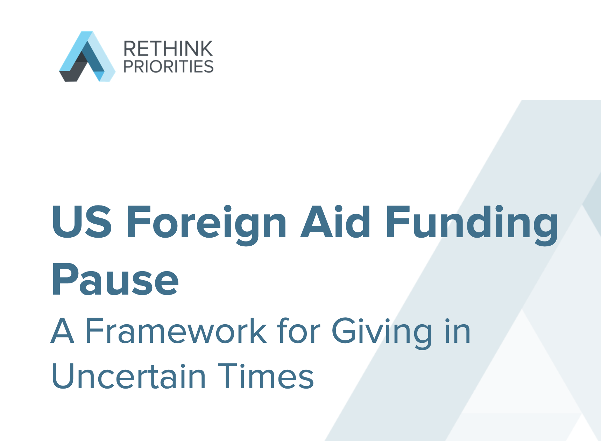

<h3>US Foreign Aid Funding Pause: A Framework for Giving</h3>

Rethink Priorities &middot; 2025

In January 2025, the US government initiated a significant pause on foreign aid obligations, disrupting critical supply chains in global health and development. This report provides a framework for donors trying to navigate this funding crisis. We outline two distinct strategies: a "Cause Approach" for donors committed to specific sectors like HIV/AIDS, and a "Funding Opportunity Approach" for those looking to fill immediate, high-impact gaps left by the withdrawal of USAID support.

<a class="btn-paper" href="files/2025-foreign-aid-pause.pdf"><i class="bi bi-file-pdf"></i> PDF</a>

<button class="tag" data-tag="global-health">Global health</button>

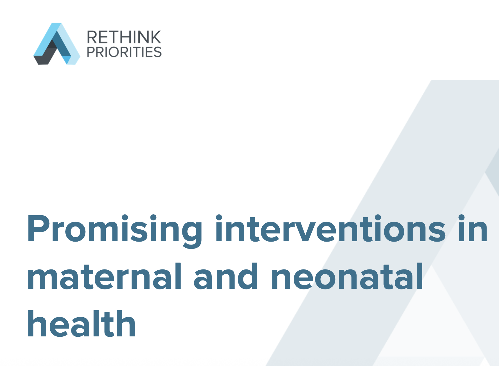

<h3>Promising Interventions in Maternal and Neonatal Health</h3>

Rethink Priorities &middot; 2025 &middot; with Greer Gosnell

Commissioned by Open Philanthropy, this report investigates tractable and neglected opportunities to reduce maternal and neonatal mortality in low- and middle-income countries. After reviewing over 50 potential interventions, we shortlisted and modeled the cost-effectiveness of three specific areas: Basic Emergency Obstetric and Newborn Care (BEmONC), Antenatal Care packages, and Injectable Antibiotics for Newborn Sepsis. The findings aim to guide philanthropic grantmaking toward the most impactful life-saving measures.

<a class="btn-paper" href="files/2025-maternal-neonatal.pdf"><i class="bi bi-file-pdf"></i> PDF</a>

<button class="tag" data-tag="global-health">Global health</button> <button class="tag" data-tag="cost-effectiveness">Cost-effectiveness</button>

## Working Papers {.research-head}

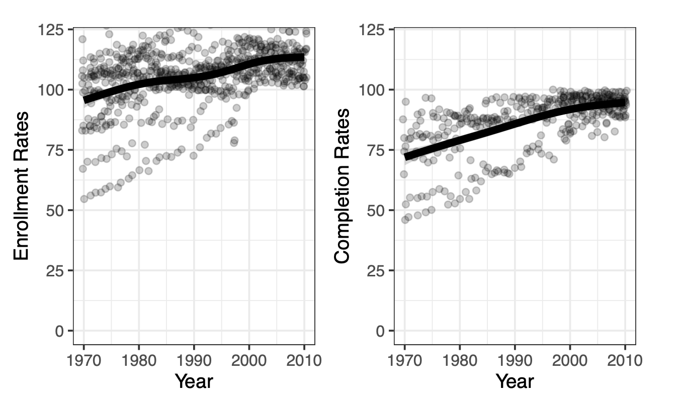

<h3>Education is Health: A Cross-Sectoral Cost-Effectiveness Framework for Adolescent Girls in LMICs</h3>

Under review &middot; 2026 &middot; with Ruby Emerson, Seth Garz, Mahlet A. Woldetsadik, Kym Cole &amp; John Firth

How should a finance ministry value an education program for adolescent girls? Traditional cost-effectiveness analysis counts only the economic returns to schooling &mdash; and, we argue, dramatically underestimates the payoff. Building an integrated cross-sectoral framework that places explicit moral weights on health, social, and economic outcomes, we find that health and social benefits account for roughly 59% of total impact for adolescent girls and young women (AGYW) in low- and middle-income countries. Benchmarked against high-performing unconditional cash transfers, the median intervention we model is about 50% more cost-effective &mdash; making the case for budgeting across, rather than within, the silos of health, education, and finance.

<a class="btn-paper" href="files/2026-education-is-health.pdf"><i class="bi bi-file-pdf"></i> Draft PDF</a>

<button class="tag" data-tag="education">Education</button> <button class="tag" data-tag="global-health">Global health</button> <button class="tag" data-tag="cost-effectiveness">Cost-effectiveness</button>

No papers match your search.

